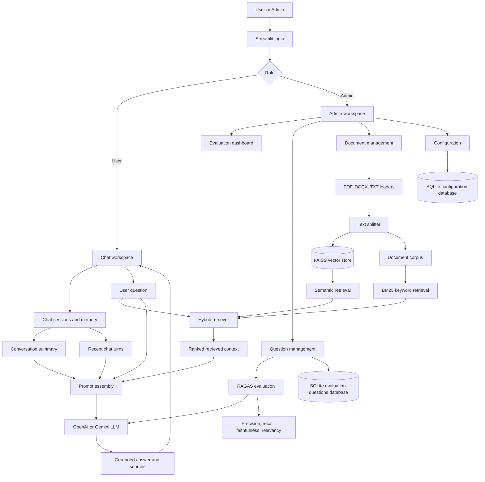

# Enterprise Knowledge Assistant

## Aetheris Dynamics

**Enterprise Knowledge Assistant**

Enterprise Knowledge Assistant is an advanced Retrieval-Augmented Generation (RAG) application built around a fictional company called **Aetheris Dynamics**. It demonstrates document ingestion, hybrid retrieval, conversational memory, role-based access, configurable RAG settings, and automated RAG evaluation.

## Problem Statement

Enterprise information is often distributed across policies, FAQs, and other internal documents. Users need a single interface where they can ask questions and receive concise, context-grounded answers instead of manually searching through multiple files.

The application addresses this problem by:

- Loading and indexing Aetheris Dynamics knowledge documents.
- Retrieving relevant content using both semantic and keyword search.
- Using conversational memory to maintain context across chat sessions.
- Showing document sources used to generate an answer.
- Providing administrators with tools to manage documents, tune the RAG pipeline, and evaluate answer quality.

## Solution Overview

The application provides separate experiences for two types of users:

### User

- Signs in through the application login screen.
- Starts, switches between, and deletes chat sessions.
- Asks questions through a conversational chat interface.
- Receives answers grounded in the indexed Aetheris Dynamics documents.
- Benefits from a conversation summary and the most recent chat turns.
- Can inspect the sources associated with assistant responses.

### Admin

Administrators have access to all user capabilities plus the following workspaces:

- **Evaluation dashboard:** Runs the stored evaluation set and reports Context Precision, Context Recall, Faithfulness, and Response Relevancy.
- **Question management:** Adds, views, updates, and deletes evaluation questions and their ground-truth answers.
- **Manage documents:** Uploads, downloads, deletes, and indexes PDF, DOCX, and TXT files. Documents are retained in the `Docs` folder and added to the vector store.
- **Configuration:** Updates model provider, model name, temperature, text splitting values, and hybrid retriever weights without changing code.

The RAG pipeline combines FAISS vector retrieval and BM25 keyword retrieval. Their normalized scores are merged using configurable weights. The selected context is provided to the language model together with the conversation summary and recent messages.

<!-- Screenshot placeholder: Add a screenshot of the user chat workspace here. -->


## Architecture Diagram



<!-- Screenshot placeholder: Add an architecture or system overview screenshot here if available. -->


## Technology Stack

| Area | Technology |
| --- | --- |
| User interface | Streamlit |
| Programming language | Python 3.11 |
| RAG orchestration | LangChain |
| Language models | OpenAI and Google Gemini through LangChain integrations |
| Embeddings | OpenAI embeddings or Google Generative AI embeddings |
| Semantic retrieval | FAISS |
| Keyword retrieval | BM25 via `rank-bm25` |
| Document loading | `pypdf`, `python-docx`, and native text-file loading |
| Text splitting | LangChain text splitters |
| Conversation memory | LangChain summary memory and in-memory chat history |
| Evaluation | RAGAS |
| Configuration and persistence | SQLite and JSON migration support |
| Data processing | NumPy and pandas |
| Packaging and deployment | pip and Docker |

## Project Structure

```text
.
├── config.json                 # Default model, retriever, embedding, and BM25 settings
├── config.py                   # Reserved configuration module
├── Dockerfile                  # Container build and Streamlit startup configuration
├── requirements.txt            # Python dependencies
├── Docs/                       # Aetheris Dynamics source documents used by the RAG pipeline
├── read.md                     # Project documentation
└── src/
    ├── app.py                  # Streamlit entry point, login, user, and admin workspaces
    ├── users.txt               # Local username|password|role records
    ├── models/                 # Configuration and response data models
    ├── modules/
    │   ├── BM25Retriever.py   # BM25 keyword retriever
    │   ├── HybridRetriever.py  # FAISS and BM25 score combination
    │   ├── RagChain.py         # Prompt and RAG chain construction
    │   ├── RagEvaluator.py     # RAGAS evaluation workflow
    │   ├── VectorStore.py      # Embeddings and FAISS operations
    │   ├── chatMemory.py       # Summary and recent conversation memory
    │   ├── docReader.py        # PDF, DOCX, and TXT document readers
    │   └── textSplitter.py     # Document chunking
    ├── utils/
    │   ├── ConfigUtility.py             # Application configuration access
    │   ├── ConfigDatabaseUtility.py     # SQLite configuration persistence
    │   ├── EvaluationQuestionUtility.py # Evaluation question persistence
    │   └── vectorStoreUtility.py        # Vector store initialization and rebuilds
    └── vectorestore/
        └── openai_faiss_index/           # Existing FAISS index files
```

The application also creates or uses `evaluation_questions.db` in the project root for configuration and evaluation-question data. The database is initialized or migrated from `config.json` when the application starts.

<!-- Screenshot placeholder: Add a screenshot of the project directory or repository structure here. -->


## Setup Instructions

### Prerequisites

- Python 3.11 or later.
- Git, if cloning the repository.
- An OpenAI API key, a Gemini API key, or both, depending on the configured providers.
- Access to a terminal such as PowerShell on Windows.

### Local setup on Windows

1. Open PowerShell in the project root.
2. Create a virtual environment:

   ```powershell
   py -3.11 -m venv .venv
   ```

3. Activate the virtual environment:

   ```powershell
   .\.venv\Scripts\Activate.ps1
   ```

4. Install dependencies:

   ```powershell
   python -m pip install --upgrade pip
   pip install -r requirements.txt
   ```

5. Create a `.env` file in the project root and add the required API keys described in the Environment Variable Requirements section.
6. Confirm that at least one readable document exists in `Docs/`.
7. Confirm or update the demo users in `src/users.txt`.
8. Start the application using the command in How to Run the Application.

### Docker setup

Build the image from the project root:

```powershell
docker build -t enterprise-knowledge-assistant .
```

Run the container and pass API keys as environment variables:

```powershell
docker run --rm -p 8501:8501 `
  -e OPENAI_API_KEY=$env:OPENAI_API_KEY `
  -e GEMINI_API_KEY=$env:GEMINI_API_KEY `
  enterprise-knowledge-assistant
```

Only pass the key or keys required by the selected provider configuration.

## Environment Variable Requirements

The application loads environment variables from a root-level `.env` file through `python-dotenv`.

| Variable | Required when | Description |
| --- | --- | --- |
| `OPENAI_API_KEY` | OpenAI is selected, and for the current evaluation and summary-memory paths | API key used by OpenAI chat and embedding integrations |
| `GEMINI_API_KEY` | Gemini is selected | API key used by Google Gemini chat and embedding integrations |

Example `.env` file:

```dotenv
OPENAI_API_KEY=your-openai-api-key
GEMINI_API_KEY=your-gemini-api-key
```

Do not commit `.env` or real API keys to source control. The local demo accounts are stored in `src/users.txt`:


Change these demo credentials before using the application in a shared or production environment. The application currently uses local file-based authentication, so it is intended for demonstration and academic project use rather than production identity management.

## How to Run the Application

From the project root, with the virtual environment activated, run:

```powershell
streamlit run src/app.py
```

Open the URL shown by Streamlit, normally:

```text
http://localhost:8501
```

Sign in with one of the accounts in `src/users.txt`. Use the admin account to manage documents, configure the RAG pipeline, maintain evaluation questions, and run RAGAS evaluation.

When documents are added or configuration values are changed, use the relevant admin action to rebuild the vector store or clear/reload the configured RAG chain as needed. The initial FAISS index is located under `src/vectorestore/openai_faiss_index/`.

<!-- Screenshot placeholder: Add a screenshot of the login screen here. -->


<!-- Screenshot placeholder: Add a screenshot of the admin evaluation dashboard here. -->


<!-- Screenshot placeholder: Add a screenshot of document management here. -->


<!-- Screenshot placeholder: Add a screenshot of configuration management here. -->


